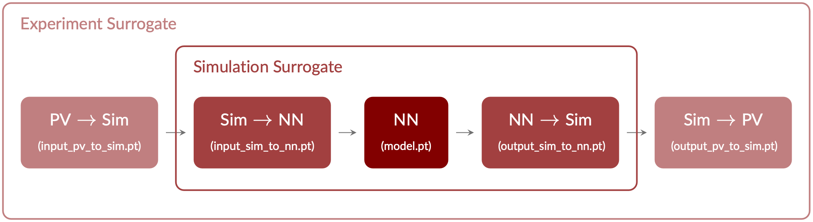
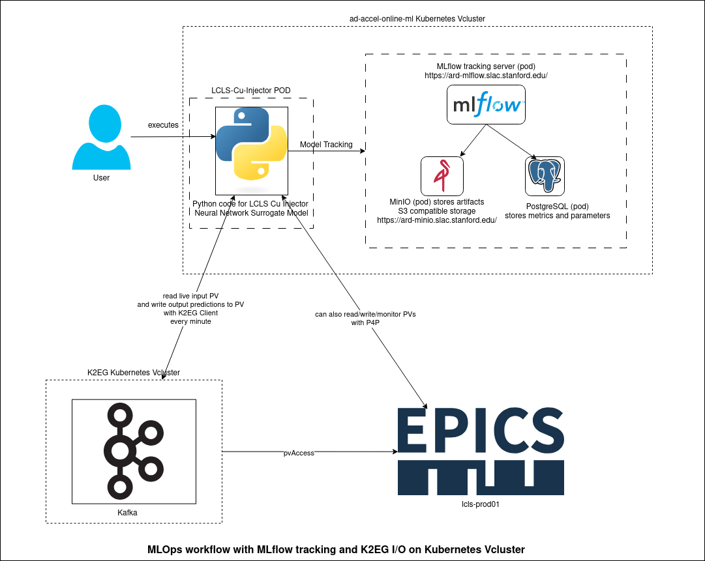

# LCLS Cu Injector NN Model

Contains the files corresponding to the LCLS Cu injector NN surrogate model and example notebooks illustrating how to load and use the model. Although not required, using [LUME-model](https://github.com/slaclab/lume-model) is recommended.

## Model Description

The model was trained by Auralee to predict beam properties at OTR2 using injector PVs for LCLS. As the model was trained with normalized data, input and output transformations have to be applied to use it on simulation data. Another layer of transformations is required for using it with EPICS data. See provided examples for more information.

<br/>

<br/><br/>

## Environment

```shell
conda env create -f environment.yml
```

## Examples

* [Load and print model information](info.ipynb)
* [Load as torch model](torch_model.ipynb)
* [Load as LUME-model](lume_model.ipynb)
* [Load as LUME-model for use with EPICS data](lume_model_epics.ipynb)

## Default Input Variables

The default value for `QE01:b1_gradient` in the [simulation variable specification](model/sim_variables.yml) has been noticed to lie outside the given value range (likewise for `QUAD:IN20:425:BACT` in the [PV variable specification](model/sim_variables.yml)).  Thus, a new value was determined by minimizing the model prediction of the transverse beam size within the valid range (documented in [this notebook](correct_inconsistent_default_value.ipynb)).

## Notes about Working with EPICS PV Values

### OTR2 / OTR3

The surrogate model was trained on predictions for OTR2. However, the OTR2 screen has been broken for a number of months and is currently unavailable for measurements. OTR3 can be used instead as in theory, there shouldn't be too much difference between the two. There are a number of quadrupoles between the two but generally these aren't changed and should stay relatively consistent. The PV for OTR3 replaces 571 with 621 to become `OTRS:IN20:621:XRMS` etc.

We don't yet have a confirmed time for when OTR2 will be back in action.

### Unmeasured Input PVs

Some of the input features used as features of the model are not available in EPICS. These include:

#### `distgen:t_dist:length:value`

This is the **pulse length** within the simulation. There has been some discussion about creating a PV to record the pulse length but for now, a reference value of 1.8550514181818183 (PV units) or 3.06083484 (sim units) is used by default.

#### `L0B_scale:voltage`

As demonstrated by the train input min and max values in [model.json](info/model.json), this value was treated as a constant when training the surrogate model. However in reality, it's PV value `ACCL:IN20:400:L0B_ADES` shows a distribution of values. If it was to be used in the model for predictions, the error would increase dramatically and therefore any measured values from EPICS are overwritten by the value seen during training, scaled to PV units.

#### `distgen:total_charge:value`

As above, the **charge value** was constant in the training dataset but it's PV value `FBCK:BCI0:1:CHRG_S` shows a distribution of values. Measured values from EPICS are overwritten by the value seen during training, scaled to PV units.

#### `distgen:r_dist:sigma_xy:value`

The value for the **beam size** (r_dist) is not measured directly in EPICS but we do measure the XRMS and YRMS value of the beam. We use these PVs (`CAMR:IN20:186:XRMS` and `CAMR:IN20:186:YRMS`) to calculate a value for the beam size using the formula:

```python
r_dist = np.sqrt(data["CAMR:IN20:186:XRMS"].values ** 2 + data["CAMR:IN20:186:YRMS"].values ** 2)
```

We call this computed PV `CAMR:IN20:186:R_DIST`. Therefore, when pulling data from the archive, this step needs to be completed in any data processing.

## MLOps


<br/>

<br/><br/>
## K2EG

To get live PVs from K2EG, we need to set ENV VARIABLE K2EG_PYTHON_CONFIGURATION_PATH_FOLDER to point to the folder that contains lcls.ini

## Containerization Steps 

Steps for accessing the Stanford Container Registry can be found [here](https://docs.google.com/presentation/d/1RwIe0a0_7rOMosRrrxSBVvYLWTcBa9JFRROJaW1MyAY/edit?slide=id.g48a5b0b15c_0_32#slide=id.g48a5b0b15c_0_32). You need to make a project in [Gitlab](https://code.stanford.edu/) to access the Registry.

# Maintaining image
Anytime, we create a new image, we update the tag for the docker image and we need to update it in deployment yaml as well to pick up the latest docker image.

```console
podman build -t lcls-cu-injector-ml:0.2 .
cat ~/.scr-token | docker login --username $USER --password-stdin http://scr.svc.stanford.edu
podman tag lcls-cu-injector-ml:0.2 scr.svc.stanford.edu/gopikab/lcls-cu-injector-ml:0.2
podman push scr.svc.stanford.edu/gopikab/lcls-cu-injector-ml:0.2
```
Log into the Kubernetes [vcluster](https://k8s.slac.stanford.edu/ad-accel-online-ml) and deploy the yaml. Don't forget to update the yaml with the latest image tag.

```python
kubectl apply -f deployment.yaml
```


## Deployment

🔍 Check if it's running:
```bash
kubectl get pods
kubectl logs <pod-name>
```
🛑 To stop the script:
```bash
kubectl scale deployment lcls-cu-injector-ml --replicas=0
```
▶️ To start again:
```bash
kubectl scale deployment lcls-cu-injector-ml --replicas=1
```
🔁 To restart the container:
```bash
kubectl rollout restart deployment lcls-cu-injector-ml
```
## 📈 Model Predictions and Monitoring

The deployed machine learning model generates five key predictions every minute based on real-time input data. These predictions are automatically logged to MLflow under the experiment lcls-injector-ML.

To view the predictions:
1. Open [MLflow](https://ard-mlflow.slac.stanford.edu)
2. Navigate to the lcls-injector-ML experiment.
3. Select the latest run.
4. Choose the desired metric from the list to visualize the prediction history.

## 🔄 Prediction Outputs

These outputs can be monitored through the MLflow UI for historical analysis or via PV monitoring tools (e.g., pvmonitor, EPICS Archiver, or custom dashboards) for real-time observation

The following predictions are logged and mapped to PVs as follows:
1. OTRS_IN20_571_XRMS -> SIOC:SYS0:ML06:AO001
2. OTRS_IN20_571_YRMS -> SIOC:SYS0:ML06:AO002
3. sigma_z -> SIOC:SYS0:ML06:AO003
4. norm_emit_x -> SIOC:SYS0:ML06:AO004
5. norm_emit_y -> SIOC:SYS0:ML06:AO005
