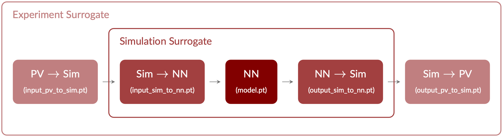

# LCLS Cu Injector NN Model

Contains the files corresponding to the LCLS Cu injector NN surrogate model and example notebooks illustrating how to load and use the model. Although not required, using [LUME-model](https://github.com/slaclab/lume-model) is recommended.

## Model Description

The model was trained by Auralee to predict beam properties at OTR2 using injector PVs for LCLS. As the model was trained with normalized data, input and output transformations have to be applied to use it on simulation data. Another layer of transformations is required for using it with EPICS data. See provided examples for more information.

<br/>

<br/><br/>

## Dependencies

```shell
lume-model
```

## Usage

From the main repository directory, call

```python
from lume_model.models import TorchModel

# load model from yaml
model = TorchModel("model_config.yaml")

# evaluate the model at a given point
print(model.evaluate({"QUAD:IN20:425:BACT": -1}))

# get model input variables
print(model.input_variables)

# get model output variables
print(model.output_variables)
```

NOTE: when not specified, input variables are set to their default values as defined in model_config.yaml


